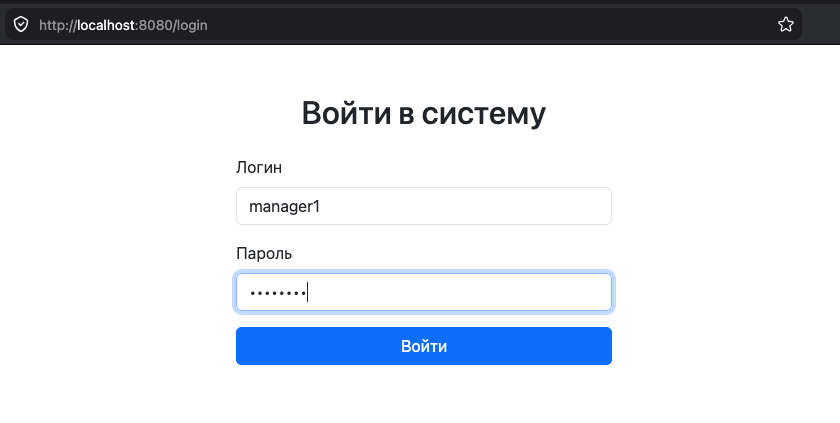
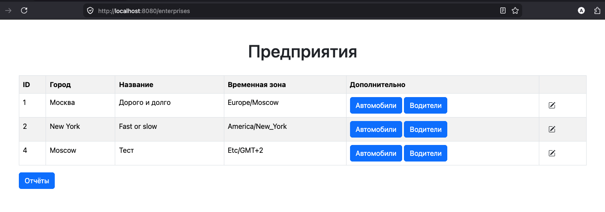
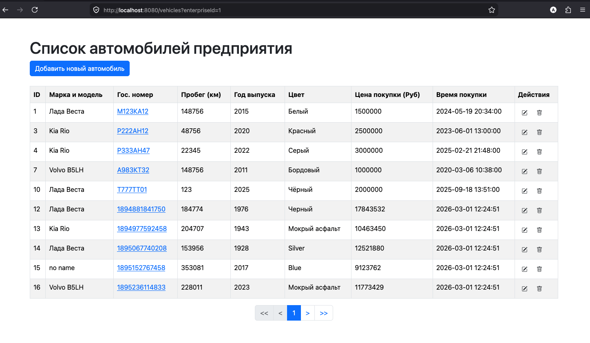
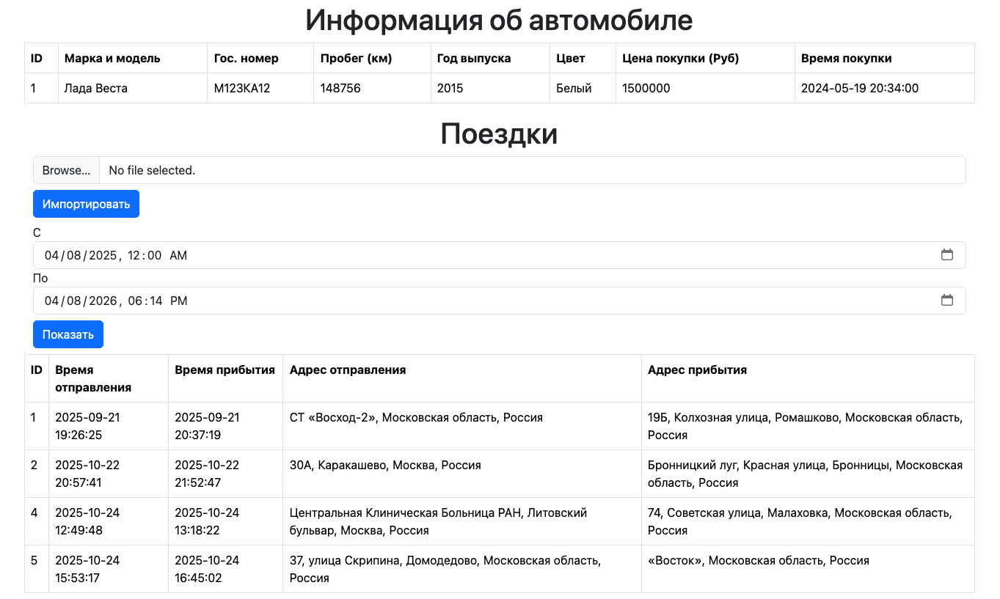
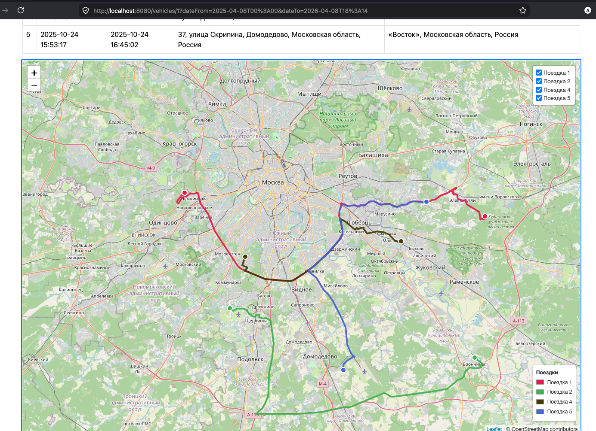
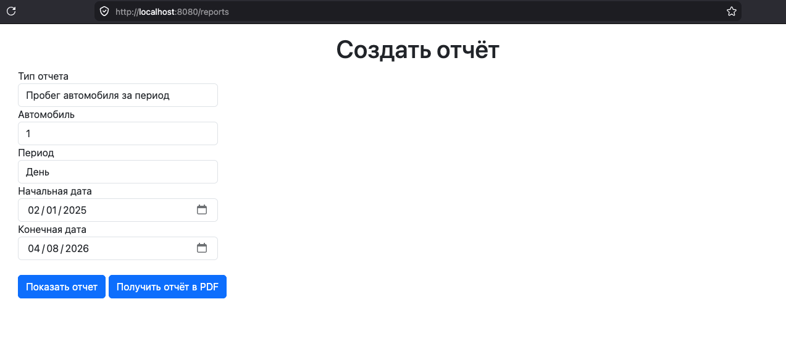
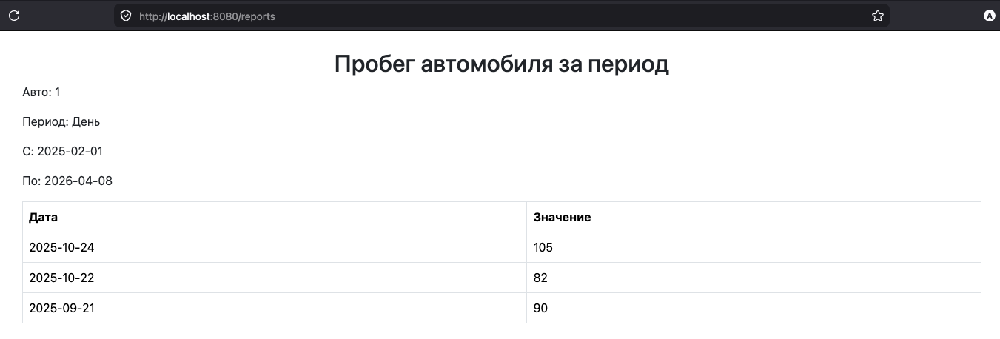
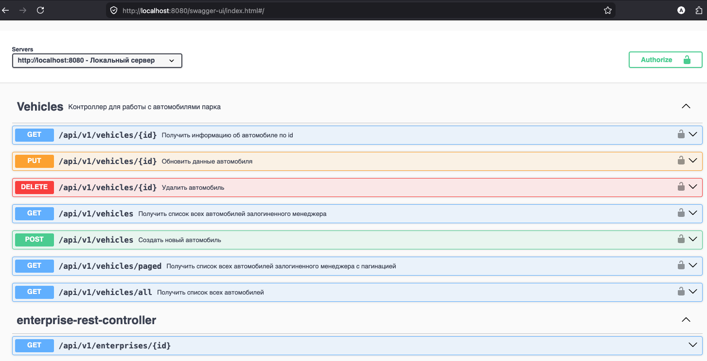
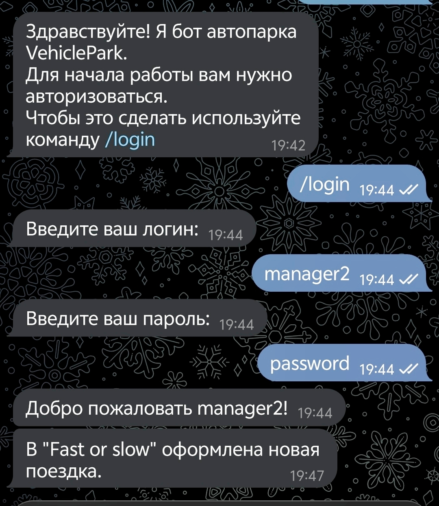

## 🚛 Сервис автопарка
[](https://www.java.com/)
[](https://spring.io/)
[](https://www.docker.com/)
[](https://prometheus.io/)
[](https://grafana.com/)

Учебный проект, основной особенностью которого является отсутствие изначальной спецификации. Я постоянно получал новые задачи, которые нужно было выполнить за ограниченное время.
Я не знал что будет дальше и бывало так, что последующие задачи ломали стройную систему, которая была выстроена при решении предыдущих. 
По ходу дела набил шишек и изучил новые технологии. Архитектура получилась далеко не лучшей, но хочется оставить этот проект в таком состоянии, чтобы потом возвращаться к нему и видеть свой рост.

---

## 📖 Оглавление

- [Возможности сервиса](#-возможности-сервиса)
- [Технологический стек](#-технологический-стек)
- [Запуск проекта](#-запуск-проекта)
- [Скриншоты интерфейса](#%EF%B8%8F-скриншоты-интерфейса)

---

## 🎯 Возможности сервиса
Это приложение для управления автопарком предприятий с водителями и автомобилями. 
Здесь можно создавать, изменять и удалять автомобили, отслеживать поездки, выгружать отчеты о пробегах и количестве поездок.
Приложением пользуются менеджеры, которые могут вести одно или несколько предприятий.
Предприятия могут находиться в разных часовых поясах. Это учитывается и время в запросах переводится в часовой пояс пользователя, либо же предприятия(при REST-запросах).
С приложением можно взаимодействовать через веб-интерфейс, REST API и частично через телеграм бота.
Хотя бот скорее нужен для получения справочной информации и уведомлений о том, что происходит на предприятиях менеджера.

Базовые вещи работают и доступны, однако тут ещё можно добавить несколько фич. Например, можно доделать некоторые круды или заняться рефакторингом. 

---

## 🛠 Технологический стек
Некоторые из этих вещей легли в основу проекта, а часть из них я добавил для того, чтобы познакомиться с тем или иным инструментом, а значит их присутствие минимально.
Из необычного: старался использовать чистый Spring, чтобы лучше освоить фреймворк.
### Ядро приложения
| Категория           | Технологии                                             |
|---------------------|--------------------------------------------------------|
| Язык                | Java                                                   |
| Сборка              | Gradle                                                 |
| Фреймворк           | Spring 6.x (Boot, MVC, Security, Shell)                |
| Работа с данными    | Hibernate, PostgreSQL + PostGIS, R2DBC (Reactive), JPA |
| Документирование API| Swagger / OpenAPI                                      |
| Генерация отчётов   | iTextPDF                                               |

### Интеграция и обмен сообщениями
| Категория           | Технологии                                                      |
|---------------------|-----------------------------------------------------------------|
| Брокер сообщений    | Apache Kafka (в ветке `microservices`)                          |
| Веб-сервер          | Tomcat, Nginx                                                   |
| Взаимодействие      | REST, Telegram Bot API                                          |

### Мониторинг и наблюдаемость
| Категория           | Технологии                                                      |
|---------------------|-----------------------------------------------------------------|
| Метрики             | Prometheus                                                      |
| Трейсинг            | OpenTelemetry                                                   |
| Визуализация        | Grafana                                                         |

### Тестирование
| Категория           | Технологии                                                      |
|---------------------|-----------------------------------------------------------------|
| Модульное           | JUnit, Mockito                                                  |
| Интеграционное      | Testcontainers                                                  |
| E2E / UI            | Cypress, Playwright                                             |
| Нагрузочное         | Gatling                                                         |

### Инфраструктура и CI/CD
| Категория           | Технологии                                                      |
|---------------------|-----------------------------------------------------------------|
| Контейнеризация     | Docker, Docker Compose                                          |
| CI/CD               | GitHub Actions                                                  |
| Тестирование API    | Postman, cURL                                                   |

---

## 🚀 Запуск проекта
Для демонстрационных целей сделана конфигурация docker compose, в которой поднимается приложение, база данных, prometheus и grafana.

1. Клонируйте проект к себе. 
2. В конфигурации используются несколько переменных окружения, которые можно найти в файле `.env.example`. 
В корне проекта создайте файл `.env` и добавьте туда необходимые переменные окружения.
3. Пропишите в терминале команду
```
docker compose -f docker-compose.demo.yml up
```

Приложение будет доступно по адресу http://localhost:8080.  

### 🔑 Демонстрационный доступ

|Логин	|Пароль	| Примечание                                          |
|-------|-------|-----------------------------------------------------|
|`manager1`	|`password`	| Учётная запись менеджера с предзаполненными данными |
|`manager2`	|`password`	| Второй менеджер (иной список предприятий)           |

База данных содержит демонстрационные записи. Поездки доступны у автомобиля с `ID = 1`, связанного с предприятием `ID = 1`. Период поездок: **2025-09-01 – 2025-10-30**.

REST API можно посмотреть через swagger UI: http://localhost:8080/api/swagger-ui  
Большинство эндпоинтов доступно только авторизованным пользователям, которые предоставили JWT-токен.  
Для его получения используйте запрос `api/v1/login`(Подробнее в swagger). 

---

## 🖼️ Скриншоты интерфейса
### Авторизация менеджера  


### Список предприятий текущего менеджера  


### Список автомобилей выбранного предприятия  


### Информация о поездках выбранного автомобиля в указанный период времени  


### Треки поездок выбранного автомобиля на карте  


### Форма генерации отчётов  


### Пример отчёта по пробегу конкретного автомобиля  


### Документация в swagger  


### Взаимодействие с telegram ботом  

